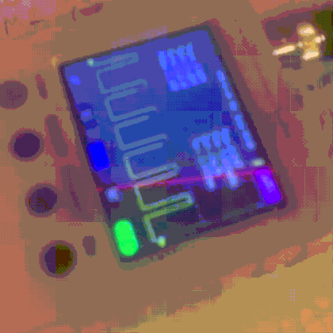

# STM32 PWM

Итерация 2: плавное изменение яркости светодиода на STM32F103C8T6 (Blue Pill).

## Что делает

Светодиод на PA0 плавно разгорается за 1 сек, потом гаснет за 1 сек.
Полный цикл — 2 секунды.

## Как это работает

- Используется TIM2 в режиме PWM.
- PA0 — это TIM2_CH1 (alternate function).
- Частота ШИМ: 1000 Гц (1000 ступеней).
- В цикле плавно меняется CCR1 от 0 до 999 и обратно.

## Что изменилось по сравнению с итерацией 1

- Добавлена функция `PWM_Init()`.
- Настроен TIM2: PSC, ARR, CCMR1, CCER, CR1.
- PA0 настроен как alternate function push-pull.
- SysTick остался для точной задержки.

## Как собрать

1. Открыть проект в STM32CubeIDE.
2. `Project → Build All`.
3. В папке `Debug/` появится `blink_stm.hex`.

## Как залить

1. Подключить ST-Link к Blue Pill.
2. Открыть STM32CubeProgrammer.
3. `Connect` (Hardware reset).
4. `Open File` → `Debug/blink_stm.hex`.
5. `Download`.
6. Нажать RESET.

## Демо

## Что пока не до конца понял

- **CCMR1** — настройка режима канала. Разобрался, что `OC1M = 110` — это PWM mode 1, но остальные биты (CC1S, OC1FE, OC1CE) пока для меня «белое пятно».

